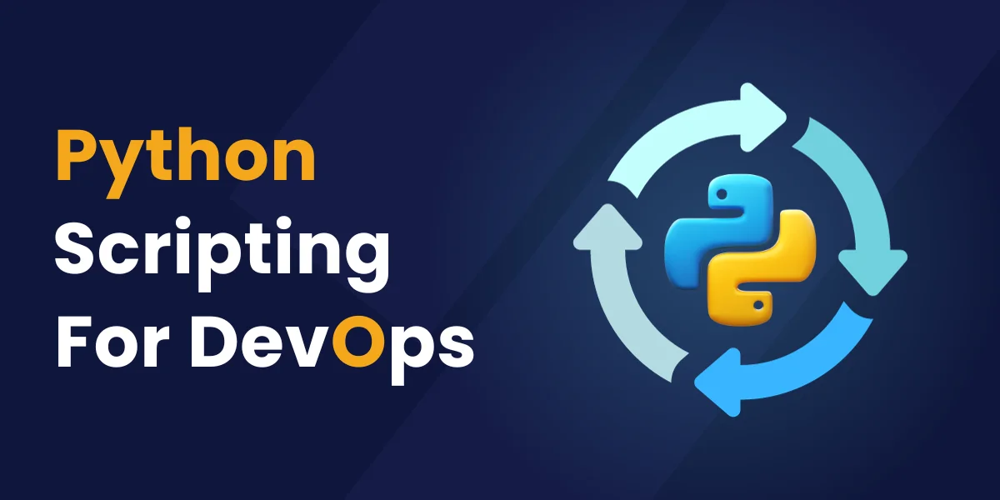
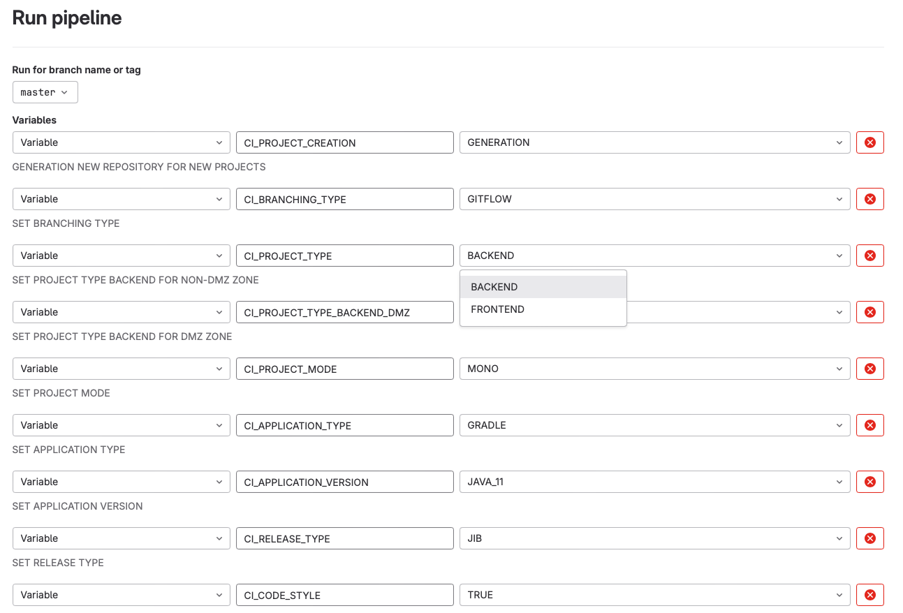
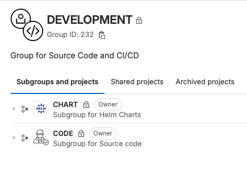
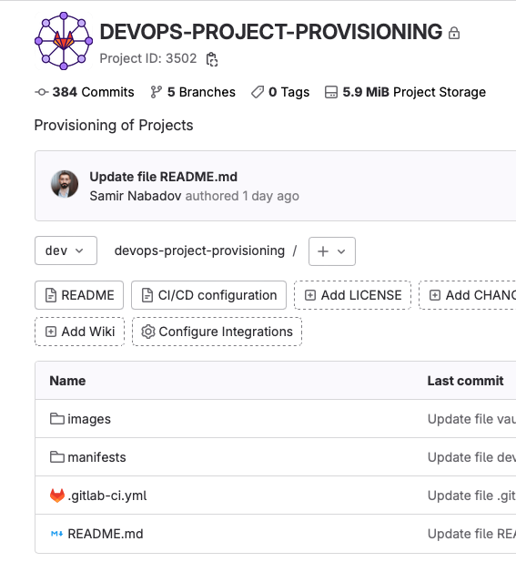

__Python-Powered Automation for Efficient Project Creation and CI/CD Workflows__
================================



## Overview

This repository contains Python-based scripts designed to automate the setup and management of projects within GitLab, streamline CI/CD pipeline configurations, manage Kubernetes deployments, and handle secrets securely through Vault and Consul integration.

### Project and Repository Management

- **Subgroup and Project Creation**: Automatically checks for and creates necessary subgroups within the main GitLab group, as well as projects within those subgroups if they don't already exist.
- **Multi-Module and Mono-Repo Setup**: Depending on the configuration, sets up projects as either multi-module or mono-repositories, including cloning necessary templates and setting up initial configurations. (The considered template files are not available in this repository)

### Dynamic .gitlab-ci.yml Modification

Python scripts dynamically update the `.gitlab-ci.yml` file to tailor the CI/CD pipeline configurations to the specific needs of each project. This includes:

- Automatically including the necessary pipeline stages and jobs.
- Configuring environment-specific variables and jobs for build, test, and deploy stages.
- Integrating with external tools and services, such as code analysis and artifact repositories. (The centralized CI template file is not available in this repo)

The `TemplateGenerator` class plays a crucial role in generating these configurations by:

- Creating a base CI/CD template that can be included in any project.
- Setting up predefined variables based on the project's requirements, such as branching strategy, project type, and deployment targets.

### Helm Chart and Template Customization

Scripts automate the customization of Helm charts and other templates for Kubernetes deployments, ensuring that they meet the project's specifications:

- Storing Helm chart templates in the template_library folder.
- Dynamically updating values in `values.yml` to match the project's deployment parameters, such as image names, tags, and environment-specific configurations.
- Customizing Kubernetes manifests and Helm templates for services, deployments, and other Kubernetes resources required by the application.

This process leverages the `TemplateGenerator` class to:

- Generate ArgoCD application and project YAML configurations, facilitating GitOps practices.
- Create Kubernetes namespace YAML files to ensure proper isolation and management of resources.

##### Key Features

- **Branch-specific Values Files**: Tailored configurations for `Develop` and `Master` branches, ensuring environment-specific deployments with ease.
- **ConfigMap Integration**: Automates the embedding of ConfigMap data into deployment templates, facilitating dynamic application configuration without manual intervention.
- **Routing with Istio**: Leverages Istio Gateway and VirtualService for sophisticated routing strategies, accommodating complex deployment patterns and service mesh requirements.
- **Multi-PVC Support**: Supports the attachment of multiple Persistent Volume Claims (PVCs) within deployments, enabling versatile storage solutions tailored to the application needs.
- **TLS Configuration in Istio**: Implements TLS settings at the Istio level for enhanced security, requiring the creation of a Kubernetes secret within the cluster which is then referenced in the Helm values.

### Access Management and Policy Application

- **User Access Control**: Manages access to projects by assigning appropriate roles (Maintainer, Developer, Reporter) based on predefined environment variables, ensuring secure access management.
- **Container Registry Policy Enforcement**: Applies policies for the rotation and deletion of old or unused Docker images in the GitLab container registry, maintaining an efficient and clean registry.

## Secrets Management

### Vault and Consul Integration

The secure management of secrets is critical for maintaining the integrity and security of the application deployment process. Our scripts integrate with Vault and Consul to achieve this, using the `TemplateGenerator` class to:

- Generate Kubernetes secrets for storing Vault and Consul access tokens securely in the cluster.
- Generate Kubernetes secrets for Docker registry credentials.
- Create Vault policies and roles dynamically, ensuring that applications have the necessary permissions to access their secrets.
- Configure Consul with the appropriate policies for service discovery and configuration management.

This integration allows for:

- Secure storage and automated rotation of secrets, minimizing the risk of secret leakage.
- Centralized management of application configurations, enabling consistent and traceable changes across environments.

## Project Structure

Here is the folder structure for the project, providing a clear overview of the main components:

```
project-root/
│
├── core/                      
│   ├── authentication/        
│   │   └── auth_manager.py
│   │
│   ├── integration/           
│   │   ├── vault_integration.py
│   │   └── consul_integration.py
│   │
│   ├── operation/             
│   │   ├── project_manager.py
│   │   ├── repo_clone_manager.py
│   │   ├── repo_push_manager.py
│   │   └── template_handler.py
│   │
│   ├── settings/              
│   │   ├── config_variables.py
│   │   └── config_validator.py
│   │
│   ├── template_library/      
│   │   ├── helm_charts/
│   │   │   ├── templates/
│   │   │   ├── Chart.yml
│   │   │   └── values.yml
│   │
│   └── utilities/             
│       └── command_executor.py
│
├── .gitlab-ci.yml             
└── main.py                    
```

## Core Components

### Authentication

- `auth_manager.py`: Handles authentication processes, including GitLab, Vault, and Consul integrations.

### Integration

- `vault_integration.py`: Manages interactions with HashiCorp's Vault for secrets storage and retrieval.
- `consul_integration.py`: Facilitates communication with Consul for service discovery and configuration.

### Operation

- `project_manager.py`: Automates the setup and configuration of GitLab projects, including subgroup creation, project initialization, and branch protection.
- `repo_clone_manager.py`: Clones necessary repositories for project setup, including code and Helm chart repositories.
- `repo_push_manager.py`: Handles pushing changes to repositories, ensuring that updates are correctly applied to GitLab projects.
- `template_handler.py`: Generates and manages various configuration templates (YAML/JSON) for Kubernetes, ArgoCD, Vault, and GitLab CI.

### Settings

- `config_variables.py`: Defines essential configuration variables and environment settings used throughout the project.
- `config_validator.py`: Validates the environment and configuration settings to ensure correct setup and operation.

### Template Library

Contains Helm chart templates and configurations for Kubernetes deployments.

- `helm_charts/`
  - `templates/`: Stores Helm chart templates.
  - `Chart.yml`: Defines the Helm chart's metadata.
  - `values.yml`: Specifies default values for the Helm chart deployment.

### Utilities

- `command_executor.py`: Provides utility methods for file and directory operations, such as creation, deletion, copying, and content modification.

## Additional Files

- `.gitlab-ci.yml`: Configures the GitLab CI/CD pipeline, defining stages and jobs for automated testing and deployment.
- `main.py`: The entry point for the project, orchestrating the setup and execution of the automation scripts.

# CI/CD Pipeline Configuration

This section outlines the Continuous Integration and Continuous Deployment (CI/CD) pipeline configured for this project, leveraging GitLab CI/CD. The pipeline is designed to automate the deployment process, enforcing code quality checks, and ensuring that each change is deployed efficiently to a Kubernetes environment.

## Pipeline Stages

The pipeline consists of a single stage:

- **deploy**: Responsible for deploying the project using a Python script. This stage is manually triggered, allowing for controlled deployments.

## Variables

The pipeline utilizes several custom variables to control the deployment process and to configure the project dynamically. These variables include:

- `CI_PROJECT_CREATION`: Specifies whether the project is being generated (`GENERATION`) or migrated (`MIGRATION`).
- `CI_BRANCHING_TYPE`: Defines the branching strategy (`GITFLOW` or `GITHUBFLOW`).
- `CI_PROJECT_TYPE`: Sets the project type (`BACKEND` or `FRONTEND`).
- `CI_PROJECT_TYPE_BACKEND_DMZ`: Indicates if the backend project is for a DMZ zone (`TRUE` or `FALSE`).
- `CI_PROJECT_MODE`: Determines the project mode (`MONO` or `MULTI`).
- `CI_APPLICATION_TYPE`: Configures the application type (`GRADLE`, `MAWEN`, `PYTHON`, `JS`).
- And more environment-specific variables to fine-tune the deployment and operational behaviors.

These variables allow for a flexible pipeline that can be adjusted based on the project's requirements without altering the pipeline's code.

## Deployment Job

The `deploy` job within the `deploy` stage utilizes a custom Docker image pre-configured with Python. It performs the following actions:

1. **Preparation**: Sets up Git configuration and installs Python dependencies from `requirement.txt`.
2. **Script Execution**: Runs `main.py`, which contains the logic for deploying the project to Kubernetes, managing CI/CD configurations, and handling Kubernetes and Helm charts deployments.

This job is tagged as `operation-03` and requires manual intervention to trigger, providing an additional layer of control before changes are deployed.

## Customizing Pipeline Variables

To customize the pipeline for your project, you can modify the variables in the `.gitlab-ci.yml` file or define them in the GitLab project's CI/CD settings for more flexibility and security.

## Triggering Deployments

To trigger a deployment:

1. Navigate to the CI/CD pipeline interface in GitLab.
2. Select the `deploy` job within the latest pipeline.
3. Click the **Play** button to manually trigger the deployment.



This setup ensures that deployments are handled smoothly, with configurations that cater to various project types and deployment strategies, highlighting the project's adaptability and scalability.



Based on the pipeline, subgroups and projects with corresponding names are created in the groups indicated on the screen, source code and helm charts are added to those repos.



Other files required for deployment are k8s namespace, argocd application project yamls are added to the central repository which are running on dynamic pipeline. (https://github.com/SamirNabadov/Centralized-Configuration-Management-via-Dynamic-Pipelines.git)

## Benefits

- Automates GitLab subgroup and project creation.
- Dynamically updates `.gitlab-ci.yml` for tailored pipeline configurations.
- Customizes Helm charts for consistent Kubernetes deployments.
- Implements GitOps with ArgoCD for efficient operations.
- Utilizes Vault and Consul for robust secrets and configuration management.
- Manages Kubernetes secrets for secure Docker registry access.
- Automatically manages access roles (Maintainer, Developer, Reporter).
- Enforces container registry policies for a clean, efficient registry.
- Reduces manual tasks, focusing efforts on development.
- Accelerates deployments, improving software delivery speed.
- Adapts to various project needs and scales with infrastructure growth.

__Requirements__
------------
* Python 3.9+ installed.
* Gitlab CI
* Kubernetes cluster access with configured ArgoCD.
* Vault by HashiCorp
* Consul by HashiCorp

__Author Information__
------------------
Samir Nabadov
